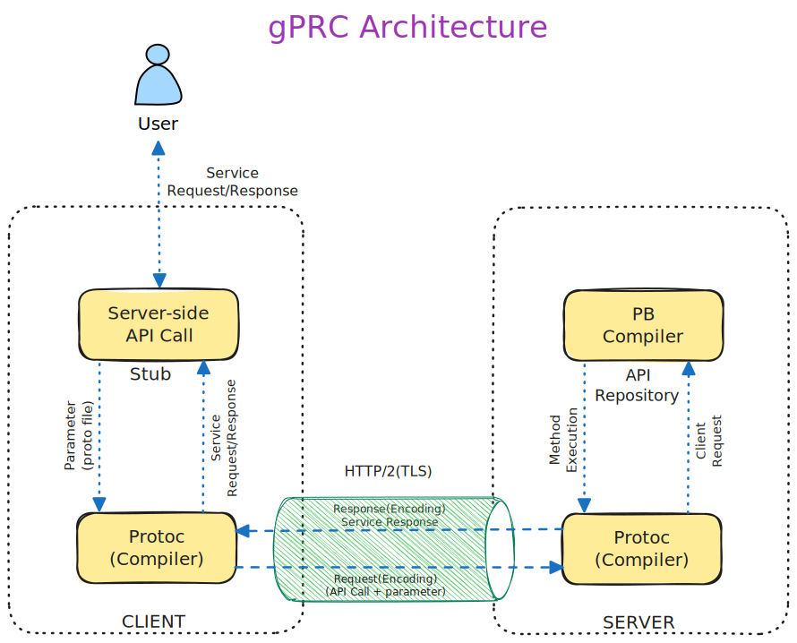

# Remote Procedure Calls (gRPC)

# **Introduction**

gPRC shines as a robust opens-source RPC (Remote Procedure Call) framework, celebrated for its ability to craft scalable and lighting-fast APIs. It’s like the magic glue that seamlessly connects client and server applications, making way for the creation of highly interconnected systems. Many tech titans, include Google, Netflix and IBM, are already onboard with gPRC, showcasing its widespread popularity and trust in the industry.

Powered by modern marvels like HTTP/2 protocol buffers and other state-of-the-art tech stacks, gPRC ensure top-notch API security, performance, and scalability. So whether you’re building the next big thing on fine-tuning existing systems, gPRC has your back, promising a smooth and efficient journey every step of the way.

# **How it works**

With gPRC, you can effortlessly connect a client application to a method on a server application, even if it’s running on a different machine. It’s like having a direct line to your server, making distributed applications and services a breeze to create.

Just like in many PRC systems, gPRC revolves around the concept of defining a service, outlining the methods that can be remotely called along with their parameters and return types. On the server side, all you need to do is implement this interface and run a gPRC server to handle client calls. Meanwhile on the client side, you have a stub (referred to as just a client in some languages) that provides the same methods as the server.

gRPC is super flexible! Whether you're running servers inside Google's tech hub or on your trusty desktop, gRPC clients and servers can chat away in any environment. Plus, you're not limited to just one language; you can code them in any of gRPC's supported languages.

Imagine this: you whip up a gRPC server in Java and pair it with clients in Go, Python, or Ruby - talk about versatility! And here's a bonus: the latest Google APIs come with gRPC versions of their interfaces. This means you can seamlessly integrate Google's powerful functionalities into your applications without breaking a sweat. How cool is that?

# **Advantages**

- **Performance:** gRPC outshines REST+JSON communication with its lightning-fast performance and top-notch API security. It achieves this by utilizing Protobuf and HTTP/2. Protobuf quickly serializes messages on both server and client sides, resulting in compact payloads. Meanwhile, HTTP/2 boosts performance with features like server push, multiplexing, and header compression. This means content can be pushed to the client before it's even requested, eliminating delays and making messages smaller for faster loading.
- **Security:** With gRPC, you can rest easy knowing your APIs are secure. It employs HTTP/2 over TLS for end-to-end encryption, ensuring that data exchanged between the client and server is safe from prying eyes. Plus, gRPC encourages the use of SSL/TLS for authentication and encryption, adding an extra layer of protection.
- **Automatic Code Generation:** Say goodbye to manual coding headaches! gRPC simplifies development with its native code generation for client/server applications. Using the protoc compiler, gRPC frameworks generate code from the .proto file, producing server-side skeletons and client-side network stubs in a flash. This saves significant development time, especially in applications with multiple services.
- **Streaming Support:** Whether you need one-way or two-way streaming, gRPC has got you covered. Its built-in support for client- or server-side streaming semantics simplifies the creation of streaming services or clients. With gRPC, you can easily set up unary, client-to-server, server-to-client, or bidirectional streaming, all thanks to the magic of HTTP/2.
- **Interoperability:** gRPC plays well with others. Designed to work seamlessly across multiple platforms and programming languages, including Java, JavaScript, Python, and more, it offers full cross-platform support. Thanks to its Protobuf binary wire format and efficient code generation, developers can build high-performing applications without worrying about compatibility issues.
- **Built-in Authentication:** Rest assured, your API communications are in good hands with gRPC. It comes with built-in support for authentication mechanisms like OAuth2 and JWT, adding an extra layer of security to your applications.
- **Scalability:** Need to handle a massive influx of requests? No problem. gRPC's lightweight and efficient architecture make scaling a breeze, making it perfect for microservices architectures and distributed systems.
- **Community and Support:** Join a thriving community of developers and get support from major tech companies like Google. With ongoing development, maintenance, and access to valuable resources, gRPC ensures you're never alone on your development journey.

# Disadvantages

- **Limited Browser Support:** Unfortunately, directly calling a gRPC service from a web browser isn't possible due to heavy reliance on HTTP/2. Modern browsers lack the necessary control over web requests to support a gRPC client. To bridge this gap, a proxy layer and gRPC-web are needed to handle conversions between HTTP/1.1 and HTTP/2 seamlessly.
- **Non-human Readable Format:** gRPC compresses messages into a format that's not exactly human-friendly. This means that developers can't just peek at the messages on the wire and understand them. To work with these messages, developers need additional tools like the gRPC command-line tool to analyze Protobuf payloads, write manual requests, and carry out debugging.
- **No Edge Caching:** Unlike HTTP, which supports edge caching, gRPC calls use the POST method, posing a challenge to API security. Responses can't be cached through intermediaries, and the gRPC specification doesn't provide provisions for caching semantics between server and client, adding a layer of complexity to caching strategies.
- **Steeper Learning Curve:** Learning gRPC and getting comfortable with Protobuf can be quite the uphill climb for many teams. Dealing with the nuances of HTTP/2 adds to the challenge. It's not uncommon for users to stick with REST for as long as possible due to this steeper learning curve.

# gPRC Architecture

In this nifty gRPC architecture diagram, we've got the gRPC client and server sides. Now, here's the cool part: every client service comes with a stub, which are like auto-generated files. Think of them as your handy interface, packed with all the remote procedures you need.

So, when the gRPC client wants to call a procedure, it simply talks to the stub, passing along the parameters destined for the server. The stub then does its magic, serializing the parameters using Protobuf (it's like wrapping them up nicely), and sends them off to the local client-time library on your machine. And just like that, your message is on its way!

So, picture this: your operating system (OS) decides it needs something from a remote server machine. It hops onto the HTTP/2 protocol train and sends its request over.

Once the server's OS catches wind of the request, it's time for action! It hands off the task to the server stub procedure, which is like the brain behind the scenes. This brainy stub decodes the parameters it receives, then gets to work executing the requested procedure using Protobuf (it's like its secret decoder ring).

Once the deed is done, the server stub packs up the response nice and tight and sends it back to the client's transport layer. Now, on the client side, it's the stub's turn to shine. It unpacks the response, hands back the parameters, and voila! The mission is complete, and everyone goes back to what they were doing. Easy peasy!
